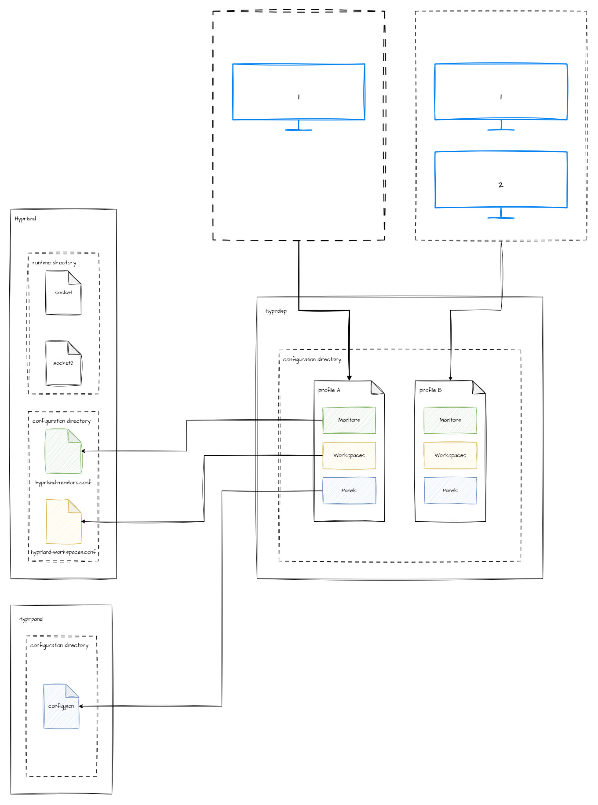

# hyprdisp

A CLI utility program for switching display profiles in Hyprland with HyprPanel installed. It remembers your configurations which is great if your computer is on-the-move.



It works by querying the connected monitors in Hyprland with

```
hyprctl monitors all
```

and creating a profile configuration file based on it. This configuration file will be in TOML format which will allow you to customize the configuration of the panels, monitors, and its attached workspaces.

## Modes

hyprdisp detect

    - create the configuration files for the monitor configuration and puts in the sane defaults.
    - if the configuration files already exist, then do nothing

hyprdisp apply

    - read the configuration files and apply them to hyprland and hyprpanel

hyprdisp listen

    - listen for changes in the monitor configurations
    - does `hyprdisp detect` on changes
    - does `hyprdisp apply` afterwards

# Usage

__Manual Workflow__

// TODO a flowchart please

__Automatic Workflow__

// TODO a flowchart please


# Configuration

## Profiles

The program will work with the following directory for the profile configurations:

```
$XDG_CONFIG_HOME/hyprdisp/
```

*Note: this is still currently a work in progress as it has been easier to write the configuration files in `$CWD/var` during development*

For the individual profile files, it is best to let `hyprdisp detect` do the generation of the file rather than creating your own. The program will create a hash ID of the monitors attached to the system and base the file name and profile selection on it.

The format adheres to TOML 1.0 specification and for the actual file contents, please refer to [this file](./doc/configuration.sample.toml)

## Hyprland Integration

The program will write to the following files:

* `$XDG_CONFIG_HOME/hyprland-monitors.conf`
* `$XDG_CONFIG_HOME/hyprland-workspace.conf`

__Important:__

`hyprdisp` will automatically add the following line to `hyprland-monitors.conf`:

```
monitor = , preferred, auto, auto
```

To be able to automatically listen to any changes in monitor events when it gets added and removed. However, adding this
into another configuration file will make it undetectable to `hyprdisp` and will result into infinite loops.

## Hyprpanel Integration

The program will write to the following files:

* `$XDG_CONFIG_HOME/hyprpanel/config.json`


# TODO

1. workspace numbering -- defaults are not sane enough. just stick to 1,2,3

2. "current" configuration should update. maybe just say `current.toml` too -- there can only be one current

3. `hyprpanel` configuration can actually be initially empty. So code must account for this and add in the `bar.layouts` accordingly

4. disabled monitors should hide the bar
